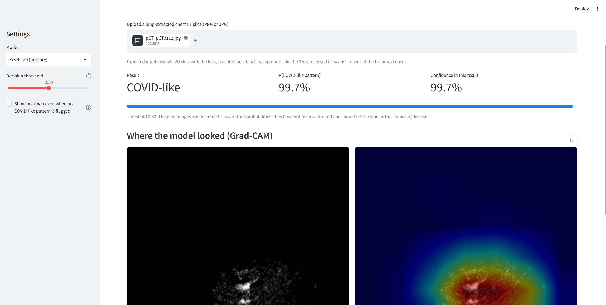
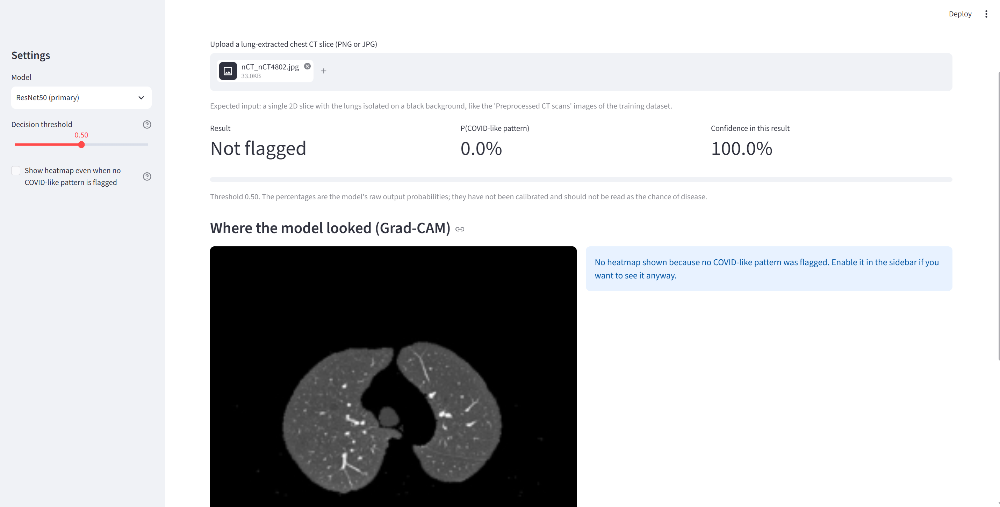
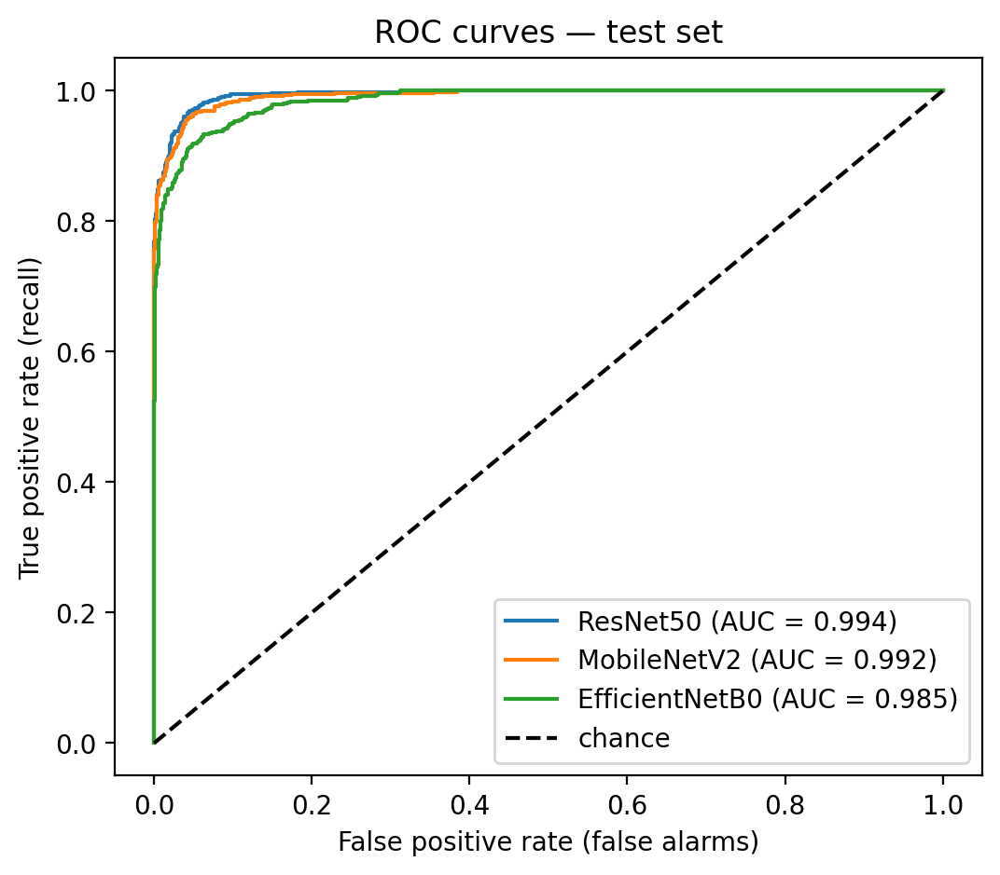
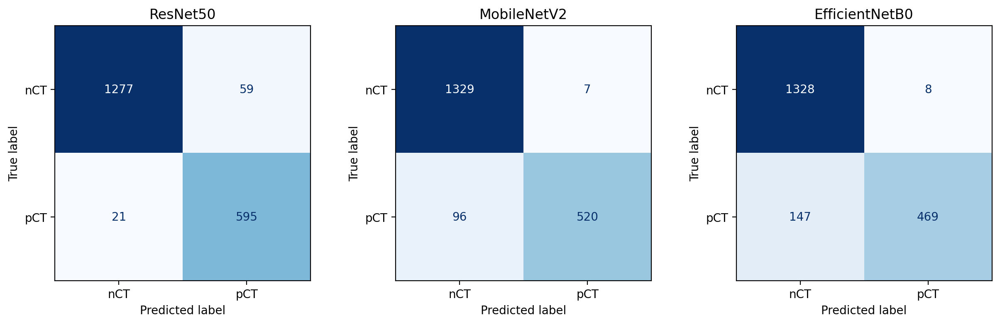
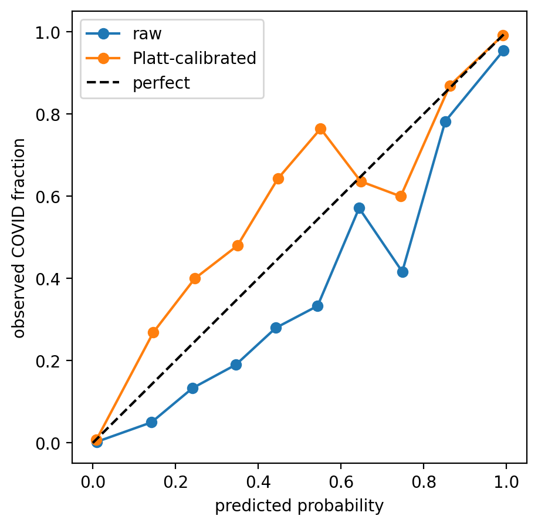
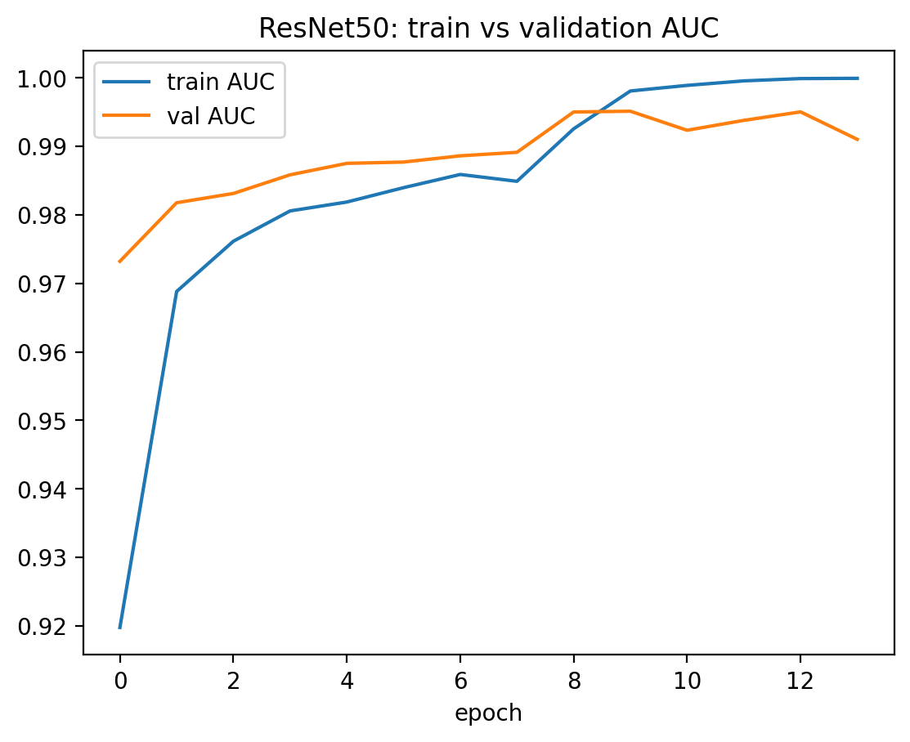
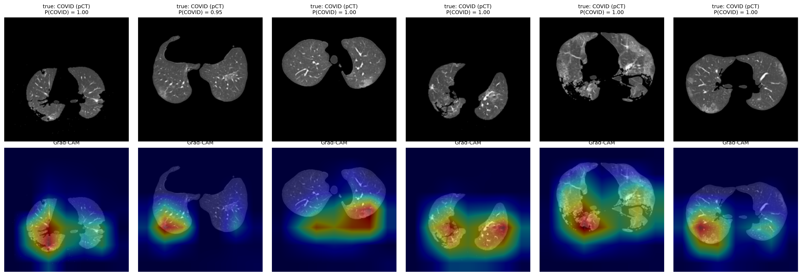
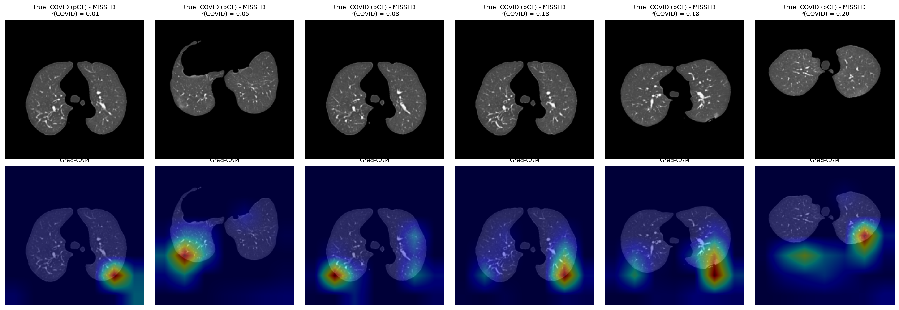

# Explainable Deep Learning Framework for COVID-19 Detection from Chest CT Scans

A transfer-learning pipeline that classifies **lung-extracted chest CT slices** as showing a *COVID-like pattern* (pCT) or *normal* (nCT), compares three CNNs (MobileNetV2, ResNet50, EfficientNetB0), explains predictions with **Grad-CAM**, and serves the best model in a **Streamlit app**.

> **Research prototype, not a medical device.** It must not be used for diagnosis or treatment decisions. See [Limitations](#limitations).

<p align="center">
  
  
</p>

## Highlights

- **ResNet50 (primary model)**: test AUC **0.994** (95% CI 0.988–0.998), sensitivity **96.6%**, specificity **95.6%** at threshold 0.5.
- **Leakage-aware evaluation:** the dataset has no patient IDs and contains near-identical neighbouring slices, so train/validation/test were split by **similarity groups** (MobileNetV2 embeddings → k-means → grouped split) instead of randomly.
- **Honest uncertainty:** cluster-bootstrap confidence intervals, error analysis, probability calibration, and Grad-CAM sanity checks.
- **Deployable demo:** Streamlit app with prediction, probability, adjustable threshold, Grad-CAM overlay, and an input check for non-lung-extracted images.

## Dataset

- **Source:** *CT Scans for COVID-19 Classification* on Kaggle (uploader Abu Zahid Bin Aziz, `azaemon`). Images come from two hospitals (Union Hospital HUST-UH and Liyuan Hospital HUST-LH), described in the preprint at <https://europepmc.org/article/ppr/ppr141530>. The lung-parenchyma extraction was performed by the dataset uploader following that paper.
- **Classes:** `pCT` (COVID-associated features clearly visible), `nCT` (features irrelevant to COVID-19 pneumonia), `NiCT` (non-informative, no lung parenchyma usable).
- **Version used:** *Preprocessed CT scans* (lung-extracted). Counts: nCT 9,979 · NiCT 5,705 · pCT 4,001.
- **Task here:** binary **pCT vs nCT**. `NiCT` is a slice-quality class, not a disease class, and was excluded.
- **Data audit:** the download contains two parallel folders (original and preprocessed), which initially double-counted the images; the audit caught this. Exact duplicates (59 groups) and one label-conflict group were removed → nCT 9,949 · pCT 4,001 used.
- **Note:** the Data Card states all images are 512×512, but sizes of 512, 574, 575 and 1211 px were found; all images were resized to 224×224.
- The dataset is **not** redistributed in this repository. Please obtain it from Kaggle and check its licence.

## Method

| Step | Choice |
|---|---|
| Input | Grayscale → 224×224 (antialiased) → 3 identical channels; pixel range 0–255, each model normalises internally |
| Augmentation (train only) | Rotation ≈ ±14°, zoom 10%, translation 5%, contrast 10%. No flips (anatomical realism) |
| Split | Similarity-grouped: MobileNetV2 embeddings → k-means (k = 400) → `StratifiedGroupKFold` → train 9,940 / val 2,058 / test 1,952 slices (COVID share 28.9% / 25.1% / 31.6%) |
| Models | ImageNet-pretrained MobileNetV2, ResNet50, EfficientNetB0 + GlobalAveragePooling → Dropout(0.3) → Dense(1, sigmoid) |
| Training | Stage 1: backbone frozen, Adam lr 1e-3 (≤ 8 epochs). Stage 2: top 30 layers unfrozen (20 for EfficientNetB0), BatchNorm frozen, lr 1e-5 (≤ 12 epochs). Batch 32, binary cross-entropy, class weights (nCT 0.70, pCT 1.73), early stopping on validation AUC, seed 42 |
| Model selection | On validation AUC **before** touching the test set |

## Results (test set, threshold 0.5, n = 1,952: 616 COVID / 1,336 normal)

| Model | AUC (95% CI) | Precision | Recall | Specificity | F1 | Accuracy | Missed | False alarms |
|---|---|---|---|---|---|---|---|---|
| **ResNet50** | **0.9944** (0.9880–0.9982) | 0.910 | 0.966 | 0.956 | 0.937 | 0.959 | 21 | 59 |
| MobileNetV2 | 0.9923 (0.9826–0.9986) | 0.987 | 0.844 | 0.995 | 0.910 | 0.947 | 96 | 7 |
| EfficientNetB0 | 0.9852 (0.9642–0.9968) | 0.983 | 0.761 | 0.994 | 0.858 | 0.921 | 147 | 8 |

Confidence intervals come from a cluster bootstrap over the similarity groups (1,000 resamples). The AUC intervals overlap, so AUC alone does not separate the models; the models differ mainly in where they sit on the precision/recall trade-off.

<p align="center">
  
  
</p>

**Screening threshold.** Choosing the threshold on *validation* data to reach 98% recall (ResNet50, threshold 0.303) gave test recall 0.984 (10 missed cases instead of 21) at the cost of 94 false alarms instead of 59.

**Ensemble.** Averaging ResNet50 and MobileNetV2 gave test AUC 0.995 but moved the operating point towards fewer false alarms (11) and more missed cases (57), so it offered no clear benefit for screening; ResNet50 alone remains the primary model.

**Calibration.** Raw ResNet50 probabilities over-predict COVID in the mid-range (ECE 0.031, Brier 0.032). Platt scaling fitted on validation reduced this to ECE 0.012, Brier 0.028, but slightly over-corrects on the test set, consistent with the different COVID prevalence in validation (25.1%) and test (31.6%). The app displays raw, uncalibrated probabilities and says so.

<p align="center">
  
  
</p>

## Explainability (Grad-CAM)

Grad-CAM is computed on the last convolutional feature maps of ResNet50 using the pre-sigmoid logit.

- On randomly sampled true-positive test slices, **56.0%** of heatmap mass lies inside lung tissue, although the lungs cover only 25.9% of the image (a perfectly lung-focused 7×7 map would reach 68.2%).
- On COVID slices the heat centre lies mostly in the lower lung zones (median relative position 0.73; only 3% fall below the lung region).
- On normal slices, the (weak) COVID-evidence heatmap falls below the lung region in **42%** of cases, suggesting partial positional bias. The app therefore shows heatmaps only for flagged slices by default.
- Some activations overlap segmentation artefacts (irregular black gaps in the lung mask).
- The dataset has no lesion annotations, so localisation accuracy was **not** measured. Grad-CAM shows model attention, not proof of disease.

<p align="center">
  
</p>

## Error analysis (ResNet50, threshold 0.5)

- 21 false negatives (3.4% of COVID slices) and 59 false positives (4.4% of normal slices).
- AUC by lung-area tertile: 0.999 (small), 0.9996 (medium), **0.978 (large)**; errors concentrate in slices with the largest lung area. This contradicted my initial hypothesis that small-lung slices would be hardest.
- 49 of 80 errors fall in 5 of the 53 test groups; 40 of the 59 false alarms sit in these groups, and near-identical neighbouring slices sometimes receive very different scores (e.g. 0.12 vs 0.98).
- 20 errors are shared by all three models (candidates for label noise or ambiguous slices); 50 of ResNet50's 80 errors are unique to it.
- Two error-heavy groups contain both pCT and nCT slices that look alike. Since labels describe *visible findings on that slice*, some errors may reflect label ambiguity; this needs radiologist review.
- The most confident missed cases look like clear lungs to a non-expert eye; they may carry subtle findings or label noise.

**Clinical implications.** In screening, a missed case is generally costlier than a false alarm; false alarms cause extra review and alarm fatigue; a confident wrong "normal" can give false reassurance. The labels describe visible COVID-like findings on a single slice, not infection status.

<p align="center">
  
</p>

## Streamlit app

```bash
python -m venv .venv
.venv\Scripts\activate            # Windows   (macOS/Linux: source .venv/bin/activate)
python -m pip install -r requirements.txt
python -m streamlit run app.py
```

1. Download `resnet50_covid.keras` (and optionally `mobilenetv2_covid.keras`) from the [Releases page](https://github.com/<YOUR-GITHUB-USERNAME>/covid-ct-xai/releases) and place it in `models/`.
2. Upload a **lung-extracted** CT slice (like the dataset's *Preprocessed CT scans*). A heuristic warns if the image looks like a full, un-segmented CT.
3. The app shows the result, raw probability (uncalibrated), an adjustable threshold, and a Grad-CAM overlay.

Tested with Python 3.13, TensorFlow 2.21.0, Keras 3.13.2.

## Repository structure

```
covid-ct-xai/
├── README.md
├── LICENSE
├── requirements.txt            # pinned versions used by the app
├── app.py                      # Streamlit app
├── gradcam_utils.py            # preprocessing, input check, Grad-CAM, overlay
├── notebooks/
│   └── covid_ct_xai.ipynb      # full Colab pipeline: audit → training → evaluation → XAI
├── models/                     # put downloaded .keras weights here (not tracked)
├── results/                    # figures and metrics tables
└── docs/                       # app screenshots
```

## Reproducing the experiments

Open `notebooks/covid_ct_xai.ipynb` in Google Colab (T4 GPU), add a Kaggle API token as a Colab secret or paste it when prompted, and run the cells in order. Full training of the three models takes roughly one to two hours on a free T4. Seeds are fixed (42); the grouped split is saved as CSV files so it can be reloaded instead of recomputed.

## Limitations

- Single public dataset from two hospitals; no external validation.
- Slice-level labels (visible COVID-like findings per slice), not patient-level diagnosis.
- No patient IDs: leakage is reduced by similarity grouping but not eliminated, so reported metrics are probably still optimistic.
- Errors concentrate in a few image groups; the confidence intervals are wide.
- Lung-extraction artefacts in the preprocessed images may influence the model.
- Heatmaps are coarse (7×7) and not validated against lesion annotations.
- Probabilities are uncalibrated by default.
- The app only handles lung-extracted slices.

## Future work

1. Attention mechanisms (SE/CBAM blocks, Vision Transformers) for sharper localisation
2. Self-supervised pretraining on unlabeled CT slices (including NiCT and original scans)
3. Clinical metadata fusion (age, symptoms, labs) when a dataset with metadata is available
4. Federated learning across the two source hospitals (e.g. FedAvg with Flower)
5. Patient-level / multi-slice modelling once patient identifiers are available
6. A NiCT-based slice-quality gate and automatic lung segmentation for raw CT input
7. Stronger XAI validation (Grad-CAM++/Score-CAM, randomisation sanity checks)
8. Grouped cross-validation, multiple seeds and external validation

## Responsible use

This is an educational and research prototype. It is not clinically validated and must not be used to make medical decisions.

## Acknowledgements

- **Dataset:** *CT Scans for COVID-19 Classification* (Kaggle, Abu Zahid Bin Aziz) and the underlying study at <https://europepmc.org/article/ppr/ppr141530>. Please also credit the original authors if you use the data.
- **Reference repository:** [`chrispathway/covid-ct-classifier`](https://github.com/chrispathway/covid-ct-classifier) was consulted as an inspiration for the overall idea of CT-based COVID classification. The code, splits, evaluation and app in this repository were written separately.
- **AI assistance:** this project was built as a learning exercise with AI-assisted guidance (Claude, by Anthropic) for explanations and code scaffolding; all experiments were run and verified by me.

## License

Code released under the MIT License (see `LICENSE`). The dataset has its own licence; see its Kaggle page.

## Author

Srimant · M.Tech Bioinformatics · [LinkedIn](https://www.linkedin.com/in/<YOUR-LINKEDIN>) · [GitHub](https://github.com/<YOUR-GITHUB-USERNAME>)
